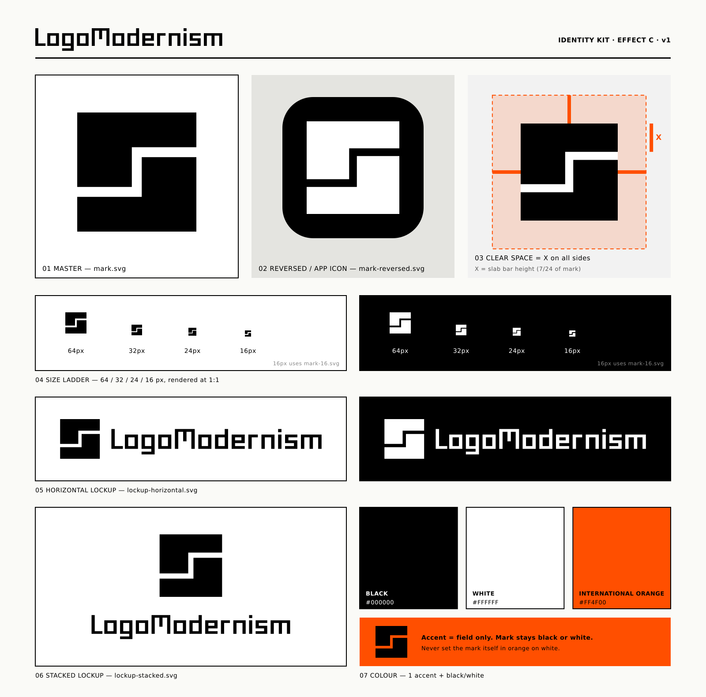

# logo-modernism

Modernist logo design **skill** + SVG workflow for AI agents (Grok Bot / Cursor / Claude-compatible).

## Identity

Chosen mark = **Effect C** (two 180°-rotated L-slabs split by one uniform Z-channel on an 8-unit grid). Accent `#FF4F00` is used as a field only. Details are in `examples/kit/GUIDE.md`. Regenerate with `python3 kit-build/build_kit.py` (needs `rsvg-convert`).

`examples/logomodernism-mark.svg` and `examples/logomodernism-mark.png` are superseded earlier drafts. The concept round is `examples/logomodernism-effect-{a,b,c}.{svg,png}`.

## What it is
- Primary design axis: **Geometric / Effect / Typographic**
- Black-first SVG craft, optical testing, concept checkpoint, then kit
- Python tools adapted from [kaankiziltug/logo-design-skill](https://github.com/kaankiziltug/logo-design-skill) (MIT) — see `third_party/`
- **No** reproduction of TASCHEN *Logo Modernism* book content
- **No** third-party trademark SVG catalog

## Layout
- `SKILL.md` — agent recipe
- `docs/` — principles, process, taxonomy
- `references/` — SVG construction, testing, critique
- `scripts/` — audit, sheets, export
- `examples/` — identity kit (`examples/kit/`), concept round, and superseded earlier drafts (`logomodernism-mark.*`)
- `kit-build/` — kit generator
- `작업방식.md` — how this bot works with the repo

## License
Instructional text and original examples: MIT.
Third-party scripts: MIT (kaankiziltug) — retain notices in `third_party/`.
